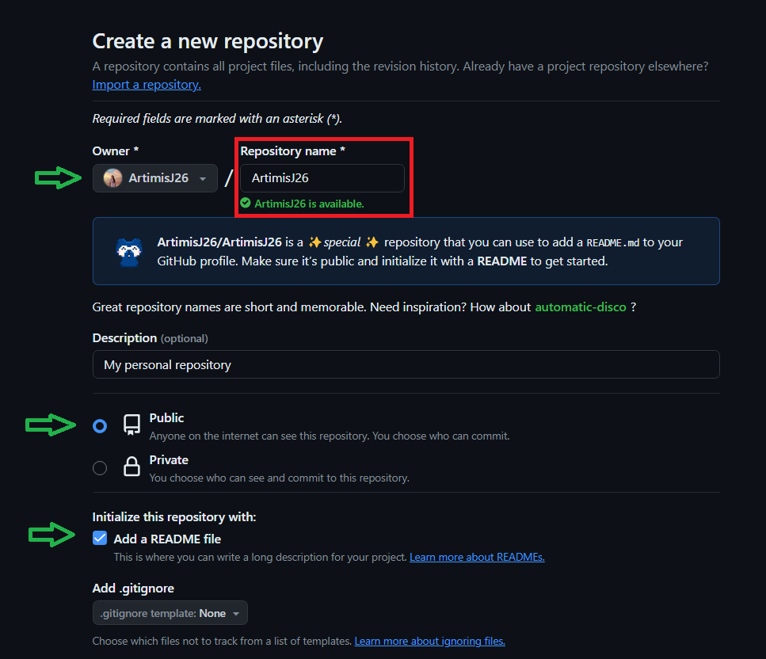

Reference: https://docs.github.com/en/account-and-profile/setting-up-and-managing-your-github-profile/customizing-your-profile/managing-your-profile-readme

As soon as I found out that we could add a README to our profile, I jumped on to the GitHub and made one for myself.

The trick is to create a new repository with the exact same name as your GitHub username and add a README file to it. This will be displayed as your profile README when someone visits your profile!

Here's a short version of the process for your convenience:

