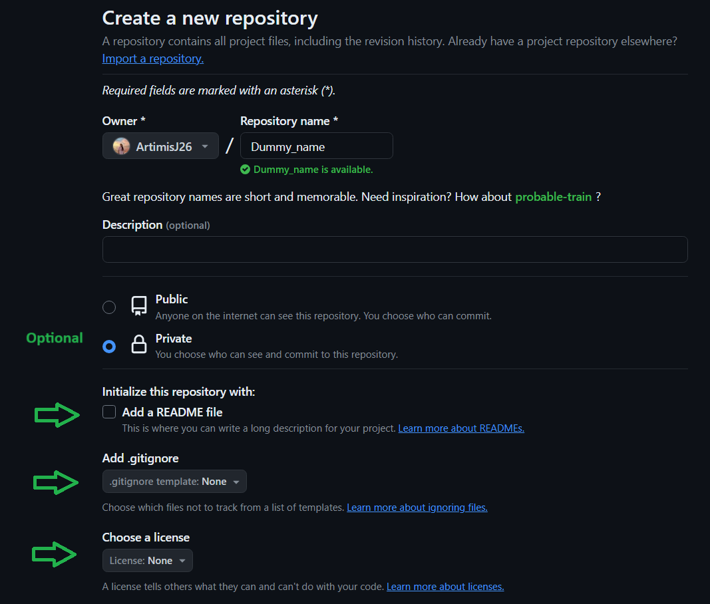
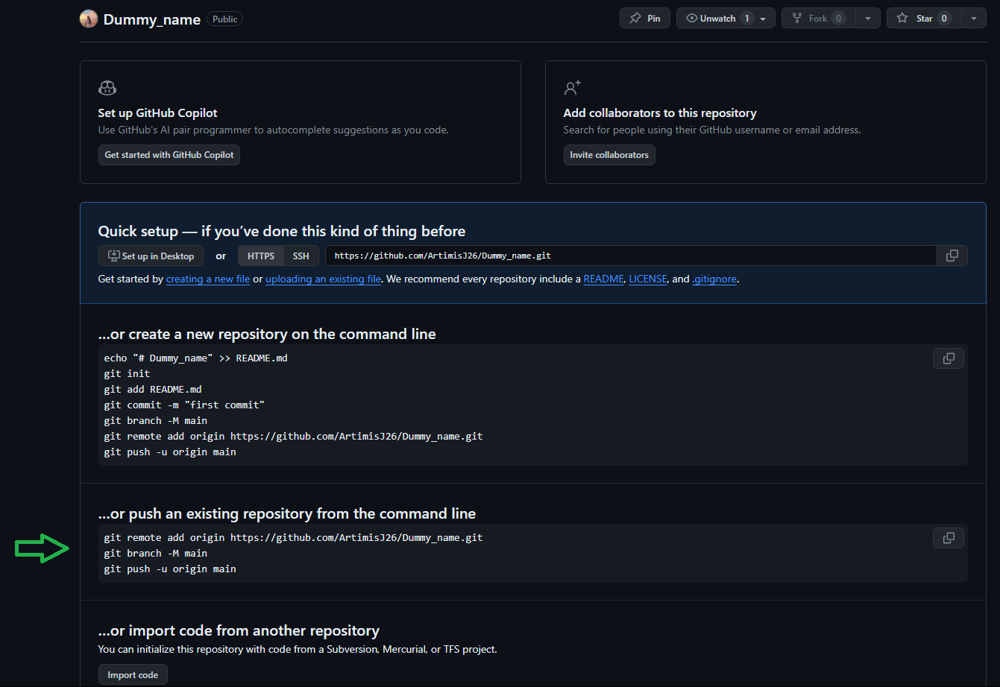
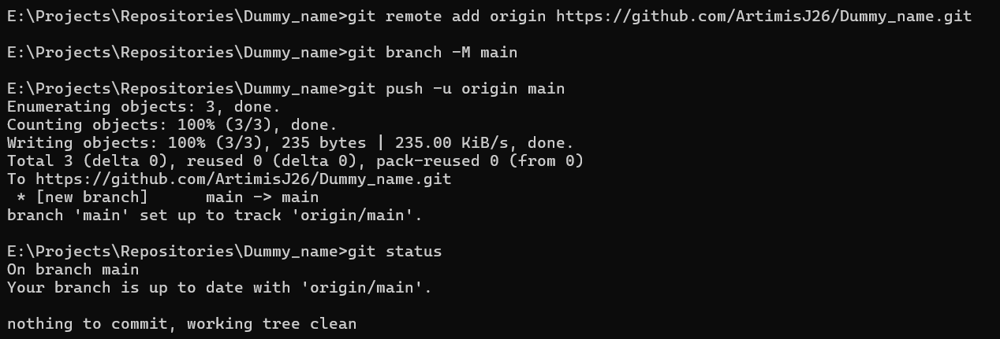
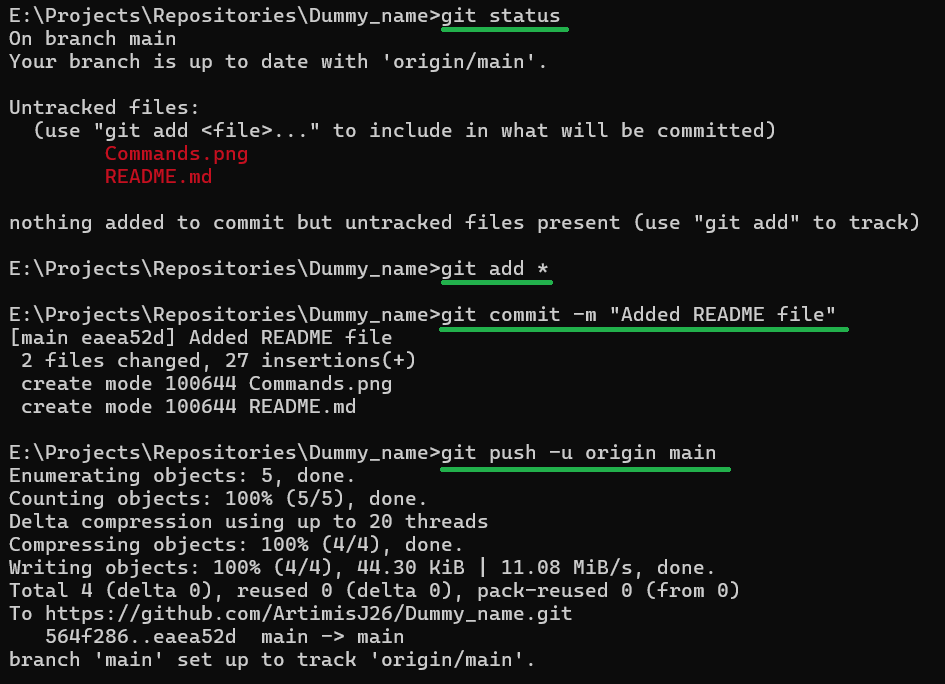
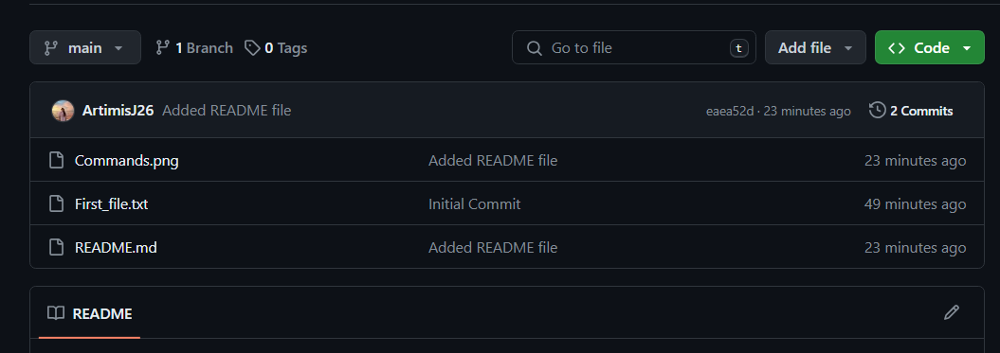

Reference: https://docs.github.com/en/migrations/importing-source-code/using-the-command-line-to-import-source-code/adding-locally-hosted-code-to-github#adding-a-local-repository-to-github-using-git

Make sure you have authenticated GitHub on your command line

Step #1:- Create a new repository on GitHub.com
Do not initialize the new repository with README, license, or gitignore files to avoid errors.

Step #2:- Link local repository to GitHub repository
Copy paste the given commands in your command line:

Step #3:- Reload the page to see your added content!
You have your local repository pushed to the GitHub!

-------------------------------------------------------------------
# Push newly added files on to GitHub.com

Details of the Commands:

'git status' 
- Shows the staged and unstaged files
- The filenames in "red" are the ones I created just now and need to be uploaded to the GitHub

'git add *'
- Added the files to the staging area

If you do 'git status' at this point, those files will appear in "green".

'git commit -m "Added README file"'
- Will commit the changes to my local git repository

'git push -u origin main'
- This will push the recently commited changes to the repository on GitHub.com

Now if you reload your GitHu repository, your newly added files will be visible!

