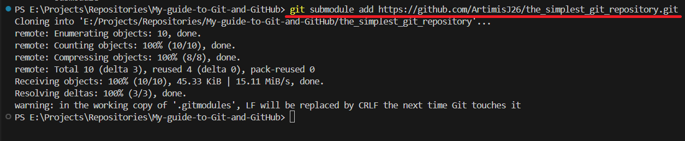

Reference: https://youtu.be/eJrh5IjWSGM

I created "The_simplest_git_repository" to demonstrate how we create a basic local git repo. But I wanted to add it to "My-guide-to-Git-and-GitHub". 
This is how I did it:

- Open terminal inside "My-guide-to-Git-and-GitHub" (PARENT) repository folder on my local machine.(You can clone the "PARENT" repository from GitHub if your don't have it locally.)
- Copy the GitHub link of the "CHILD" repository.
- Run the following command on the "PARENT" folder terminal that you just opened:
'''Bash
git submodule add https://github.com/ArtimisJ26/the_simplest_git_repository.git
'''
- In this case "The_simplest_git_repository" was my "CHILD" repository, who's link I added to the ''' submodule ''' command

